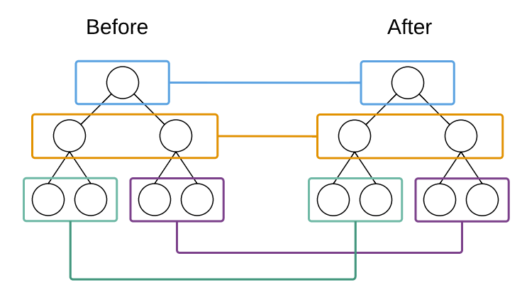

# `React`

## 环境准备

### 同过脚手架

```
// Node >= 6 and npm >= 5.2
npx create-`React`-app my-app
cd my-app
npm start
```

## Virtual DOM

虚拟DOM是`React`的一大亮点，具有batching(批处理)和高效的Diff算法,由虚拟 DOM来确保只对界面上真正变化的部分进行实际的DOM操作。
```md
<!-- `React`官网说明 -->
有一些通用的解决方案，对于生成最小操作数的这个算法问题，以将一棵树转换为另一棵树。然而，在state of the art algorithms 中有时间复杂度为O(n3)，在这里n代表树中元素个数。

若我们在`React`中使用，展示1000个元素则需要进行10亿次的比较。这太过昂贵。与此不同，`React`基于两点假设，实现了一个启发的O(n)算法：

1.两个不同类型的元素将产生不同的树。
2.开发者可以使用key属性来提示哪些子元素贯穿不同渲染是稳定的。
```



`React`只会对相同颜色方框内的DOM节点进行比较，即同一个父节点下的所有子节点。当发现节点已经不存在，则该节点及其子节点会被完全删除掉，不会用于进一步的比较。这样只需要对树进行一次遍历，便能完成整个DOM树的比较。

## `React`与其他框架的对比

 相比起 `React`，其他 MVVM 系框架比如 `Angular`, `Knockout` 以及 `Vue`、`Avalon` 采用的都是数据绑定：通过 Directive/Binding 对象，观察数据变化并保留对实际 DOM 元素的引用，当有数据变化时进行对应的操作。MVVM 的变化检查是数据层面的，而 `React` 的检查是 DOM 结构层面的。

 MVVM 的性能也根据变动检测的实现原理有所不同：`Angular` 的脏检查使得任何变动都有固定的 O(watcher count) 的代价；`Knockout`/`Vue`/`Avalon` 都采用了依赖收集，在 js 和 DOM 层面都是 O(change)

 在比较性能的时候，要分清楚初始渲染、小量数据更新、大量数据更新这些不同的场合。Virtual DOM、脏检查 MVVM、数据收集 MVVM 在不同场合各有不同的表现和不同的优化需求。Virtual DOM 为了提升小量数据更新时的性能，也需要针对性的优化，比如 shouldComponentUpdate 或是 immutable data。

- 初始渲染：Virtual DOM > 脏检查 >= 依赖收集
- 小量数据更新：依赖收集 >> Virtual DOM + 优化 > 脏检查（无法优化） > Virtual DOM 无优化
- 大量数据更新：脏检查 + 优化 >= 依赖收集 + 优化 > Virtual DOM（无法/无需优化）>> MVVM 无优化

## 组件

组件可以将UI切分成一些独立的、可复用的部件，这样你就只需专注于构建每一个单独的部件

定义一个组件最简单的方式是使用JavaScript函数
```js
function Welcome(props) {
  return <h1>Hello, {props.name}</h1>;
}
```
该函数是一个有效的React组件，它接收一个单一的“props”对象并返回了一个React元素。我们之所以称这种类型的组件为**函数定义组件**

我们也可以使用 `ES6 class` 来定义一个组件

```js
class Welcome extends React.Component {
  render() {
    return <h1>Hello, {this.props.name}</h1>;
  }
}
```

**无论是使用函数或是类来声明一个组件，它决不能修改它自己的props,所有的React组件必须像纯函数那样使用它们的props**

## 生命周期


```js
componentWillMount   // 组件挂载之前

 render  //  组件挂载

 componentDidMount   // 组件挂载之后

 componentWillReceiveProps  // props 发生改变的时候触发

 shouldComponentUpdate  // 组件是否更新

 componentWillUpdate  // 组件将要更新

 componentDidUpdate  // 组件已经更新

 componentWillUnmout  // 组件将被卸载

```

`componentWillReceiveProps` : props 发生改变调用 在组件从父组件接受参数的时候，并且这个组件已经存在父组件中，父组件render重新执行的时候都会触发`componentWillReceiveProps`执行，如果是第一次存在与父组件中,`componentWillReceiveProps`是不会执行的。

`componentWillReceiveProps` : return true组件会重新渲染，false阻止重新渲染。


```js
// react 官网clock例子：
class Clock extends React.Component {
  constructor(props) {
    super(props);
    this.state = {date: new Date()};
  }

  componentDidMount() {
    this.timerID = setInterval(
      () => this.tick(),
      1000
    );
  }

  componentWillUnmount() {
    clearInterval(this.timerID);
  }

  tick() {
    this.setState({
      date: new Date()
    });
  }

  render() {
    return (
      <div>
        <h1>Hello, world!</h1>
        <h2>It is {this.state.date.toLocaleTimeString()}.</h2>
      </div>
    );
  }
}

ReactDOM.render(
  <Clock />,
  document.getElementById('root')
);
```

## state注意事项

### 不要直接更新状态

```js
// Wrong
this.state.comment = 'Hello';
```

应当使用 `setState()`

```js
// Correct
this.setState({comment: 'Hello'});
```
### 状态更新可能是异步的

`React` 可以将多个`setState()` 调用合并成一个调用来提高性能。

因为 `this.props` 和 `this.state` 可能是异步更新的，你不应该依靠它们的值来计算下一个状态。

```js
// Wrong
this.setState({
  counter: this.state.counter + this.props.increment,
});
```
要修复它，请使用第二种形式的 setState() 来接受一个函数而不是一个对象。 该函数将接收先前的状态作为第一个参数，将此次更新被应用时的props做为第二个参数。

```js
// Correct
this.setState((prevState, props) => ({
  counter: prevState.counter + props.increment
}));
```
## JSX

```jsx
const element = <h1>Hello, world!</h1>
```


这种看起来可能有些奇怪的标签语法既不是字符串也不是 HTML

它被称为 JSX， 一种 JavaScript 的语法扩展。 我们推荐在 React 中使用 JSX 来描述用户界面。JSX 乍看起来可能比较像是模版语言，但事实上它完全是在 JavaScript 内部实现的。

### 在 JSX 中使用表达式

```js
constructor(props){
  super(props)
  this.state = {isShow:true}
  }
  render(){
    const { name, age, children } = this.props
    return(
      {/*注释*/}
      <div class="jsx-wrapper">
       { this.state.isShow ? 1 : 2 }
      </div>
  )
}
```

### JSX 防注入攻击

React DOM 在渲染之前默认会 过滤 所有传入的值。它可以确保你的应用不会被注入攻击。所有的内容在渲染之前都被转换成了字符串。这样可以有效地防止 XSS(跨站脚本) 攻击。

## 事件处理

- React事件绑定属性的命名采用驼峰式写法，而不是小写。
- 如果采用 JSX 的语法你需要传入一个函数作为事件处理函数，而不是一个字符串(DOM元素的写法)

```js

<button onClick={activateLasers}>
  Activate Lasers
</button>
```

在 React 中另一个不同是你不能使用返回 false 的方式阻止默认行为。你必须明确的使用 preventDefault。

```js
class Toggle extends React.Component {
  constructor(props) {
    super(props);
    this.state = {isToggleOn: true};

    // This binding is necessary to make `this` work in the callback
    this.handleClick = this.handleClick.bind(this);
    this.stopClick = this.stopClick.bind(this)
  }

  handleClick() {
    this.setState(prevState => ({
      isToggleOn: !prevState.isToggleOn
    }));
  }
  stopClick (e) {
    e.preventDefault();
    console.log('The link was clicked.');
  }


  render() {
    return (
      <div class="wrapper">
        <button onClick={this.handleClick}>
          {this.state.isToggleOn ? 'ON' : 'OFF'}
        </button>
        <button onClick={this.stopClick}>
          阻止点击
        </button>
      </div>
    );
  }
}

ReactDOM.render(
  <Toggle />,
  document.getElementById('root')
);
```
:::tip
必须谨慎对待 JSX 回调函数中的 this，类的方法默认是不会绑定 this 的。如果你忘记绑定 this.handleClick 并把它传入 onClick, 当你调用这个函数的时候 this 的值会是 undefined。
:::

如果使用 bind 让你很烦，这里有两种方式可以解决。如果你正在使用实验性的属性初始化器语法，你可以使用属性初始化器来正确的绑定回调函数。

```js
class LoggingButton extends React.Component {
  // This syntax ensures `this` is bound within handleClick.
  // Warning: this is *experimental* syntax.
  handleClick = () => {
    console.log('this is:', this);
  }

  render() {
    return (
      <button onClick={this.handleClick}>
        Click me
      </button>
    );
  }
}
```

如果你没有使用属性初始化器语法，你可以在回调函数中使用 箭头函数。

```js
class LoggingButton extends React.Component {
  handleClick() {
    console.log('this is:', this);
  }

  render() {
    // This syntax ensures `this` is bound within handleClick
    return (
      <button onClick={(e) => this.handleClick(e)}>
        Click me
      </button>
    );
  }
}

```

### 向事件处理程序传递参数

通常我们会为事件处理程序传递额外的参数。例如，若是 id 是你要删除那一行的 id，以下两种方式都可以向事件处理程序传递参数

```js
<button onClick={(e) => this.deleteRow(id, e)}>Delete Row</button>
<button onClick={this.deleteRow.bind(this, id)}>Delete Row</button>
```
分别通过 `arrow functions` 和 `Function.prototype.bind` 来为事件处理函数传递参数。

## 列表

```js
function NumberList(props) {
  const numbers = props.numbers;
  return (
    <ul>
      {numbers.map((number) =>
        <ListItem key={number.toString()}
                  value={number} />

      )}
    </ul>
  );
}
```

Keys可以在DOM中的某些元素被增加或删除的时候帮助React识别哪些元素发生了变化。因此你应当给数组中的每一个元素赋予一个确定的标识。

一个元素的key最好是这个元素在列表中拥有的一个独一无二的字符串。通常，我们使用来自数据的id作为元素的key。

```js
const todoItems = todos.map((todo) =>
  <li key={todo.id}>
    {todo.text}
  </li>
);
```

当元素没有确定的id时，你可以使用他的序列号索引index作为key

```js
const todoItems = todos.map((todo, index) =>
  // Only do this if items have no stable IDs
  <li key={index}>
    {todo.text}
  </li>
);
```

:::tip
如果列表项目的顺序可能会变化，我们不建议使用索引来用作键值，因为这样做会导致性能的负面影响，还可能引起组件状态问题。如果你想要了解更多，请点击[深度解析key的必要性](https://react.docschina.org/docs/reconciliation.html#%E9%80%92%E5%BD%92%E5%AD%90%E8%8A%82%E7%82%B9)。如果你选择不指定显式的键值，那么React将默认使用索引用作为列表项目的键值。
:::

:::tip
key会作为给React的提示，但不会传递给你的组件。如果您的组件中需要使用和key相同的值，请用其他属性名显式传递这个值
:::

```js
const content = posts.map((post) =>
  <Post
    key={post.id}
    id={post.id}
    title={post.title} />
);
```

上面例子中，Post组件可以读出props.id，但是不能读出props.key

## JSX中的子代

在既包含开始标签又包含结束标签的 JSX 表达式中，这两个标签之间的内容被传递为专门的属性：props.children。有几种不同的方法来传递子代。

### 字符串字面量

```js
<MyComponent>Hello world!</MyComponent>
```
这是有效的 JSX，并且 MyComponent 的 props.children 值将会直接是 "hello world!"。


### JSX子代

可以提供更多个 JSX 元素作为子代，这对于嵌套显示组件非常有用

```js
<MyContainer>
  <MyFirstComponent />
  <MySecondComponent />
</MyContainer>
```

React 组件也可以返回包含多个元素的一个数组
```js
render() {
  // 不需要使用额外的元素包裹数组中的元素！
  return [
    // 不要忘记 key :)
    <li key="A">First item</li>,
    <li key="B">Second item</li>,
    <li key="C">Third item</li>,
  ];
}
```

### JavaScript 表达式作为子代

将任何 {} 包裹的 JavaScript 表达式作为子代传递。

### 布尔值、Null 和 Undefined 被忽略

false、null、undefined 和 true 都是有效的子代，只是它们不会被渲染。下面的JSX表达式将渲染为相同的东西。

```js
<div />

<div></div>

<div>{false}</div>

<div>{null}</div>

<div>{undefined}</div>

<div>{true}</div>
```

这在根据条件来确定是否渲染React元素时非常有用。以下的JSX只会在showHeader为true时渲染<Header />组件。

```js
<div>
  {showHeader && <Header />}
  <Content />
</div>
```

如果你想让类似 false、true、null 或 undefined 出现在输出中，你必须先把它转换成字符串

```js
<div>
  My JavaScript variable is {String(myVariable)}.
</div>
```

## PropTypes

React 也有一些内置的类型检查功能。要检查组件的属性，你需要配置特殊的 propTypes 属性

```js
import PropTypes from 'prop-types';

class Greeting extends React.Component {
  render() {
    return (
      <h1>Hello, {this.props.name}</h1>
    )
  }
}

Greeting.propTypes = {
  name: PropTypes.string
}
```

使用不同验证器的例子

```js
import PropTypes from 'prop-types';

MyComponent.propTypes = {
  // 你可以将属性声明为以下 JS 原生类型
  optionalArray: PropTypes.array,
  optionalBool: PropTypes.bool,
  optionalFunc: PropTypes.func,
  optionalNumber: PropTypes.number,
  optionalObject: PropTypes.object,
  optionalString: PropTypes.string,
  optionalSymbol: PropTypes.symbol,

  // 任何可被渲染的元素（包括数字、字符串、子元素或数组）。
  optionalNode: PropTypes.node,

  // 一个 React 元素
  optionalElement: PropTypes.element,

  // 你也可以声明属性为某个类的实例，这里使用 JS 的
  // instanceof 操作符实现。
  optionalMessage: PropTypes.instanceOf(Message),

  // 你也可以限制你的属性值是某个特定值之一
  optionalEnum: PropTypes.oneOf(['News', 'Photos']),

  // 限制它为列举类型之一的对象
  optionalUnion: PropTypes.oneOfType([
    PropTypes.string,
    PropTypes.number,
    PropTypes.instanceOf(Message)
  ]),

  // 一个指定元素类型的数组
  optionalArrayOf: PropTypes.arrayOf(PropTypes.number),

  // 一个指定类型的对象
  optionalObjectOf: PropTypes.objectOf(PropTypes.number),

  // 一个指定属性及其类型的对象
  optionalObjectWithShape: PropTypes.shape({
    color: PropTypes.string,
    fontSize: PropTypes.number
  }),

  // 你也可以在任何 PropTypes 属性后面加上 `isRequired` 
  // 后缀，这样如果这个属性父组件没有提供时，会打印警告信息
  requiredFunc: PropTypes.func.isRequired,

  // 任意类型的数据
  requiredAny: PropTypes.any.isRequired,

  // 你也可以指定一个自定义验证器。它应该在验证失败时返回
  // 一个 Error 对象而不是 `console.warn` 或抛出异常。
  // 不过在 `oneOfType` 中它不起作用。
  customProp: function(props, propName, componentName) {
    if (!/matchme/.test(props[propName])) {
      return new Error(
        'Invalid prop `' + propName + '` supplied to' +
        ' `' + componentName + '`. Validation failed.'
      );
    }
  },

  // 不过你可以提供一个自定义的 `arrayOf` 或 `objectOf` 
  // 验证器，它应该在验证失败时返回一个 Error 对象。 它被用
  // 于验证数组或对象的每个值。验证器前两个参数的第一个是数组
  // 或对象本身，第二个是它们对应的键。
  customArrayProp: PropTypes.arrayOf(function(propValue, key, componentName, location, propFullName) {
    if (!/matchme/.test(propValue[key])) {
      return new Error(
        'Invalid prop `' + propFullName + '` supplied to' +
        ' `' + componentName + '`. Validation failed.'
      );
    }
  })
}
```

### 限制单个子代

```js
import PropTypes from 'prop-types';

class MyComponent extends React.Component {
  render() {
    // This must be exactly one element or it will warn.
    const children = this.props.children;
    return (
      <div>
        {children}
      </div>
    );
  }
}

MyComponent.propTypes = {
  children: PropTypes.element.isRequired
};
```

### 属性默认值
可以通过配置 defaultProps 为 props定义默认值


```js
class Greeting extends React.Component {
  render() {
    return (
      <h1>Hello, {this.props.name}</h1>
    );
  }
}

// 为属性指定默认值:
Greeting.defaultProps = {
  name: 'Stranger'
};

// 渲染 "Hello, Stranger":
ReactDOM.render(
  <Greeting />,
  document.getElementById('example')
);
```

## Refs
:::tip
Refs 提供了一种方式，用于访问在 render 方法中创建的 DOM 节点或 React 元素。
:::

### 创建 Refs

```js
class MyComponent extends React.Component {
  constructor(props) {
    super(props);
    this.myRef = React.createRef();
  }
  render() {
    return <div ref={this.myRef} />;
  }
}
```

使用 `React.createRef()` 创建 refs，通过 ref 属性来获得 React 元素。当构造组件时，refs 通常被赋值给实例的一个属性，这样你可以在组件中任意一处使用它们。

### 访问 Refs

当一个 ref 属性被传递给一个 render 函数中的元素时，可以使用 ref 中的 current 属性对节点的引用进行访问。

```js
const node = this.myRef.current
```

### 使用 ref 存储对 DOM 节点的引用

```js
class CustomTextInput extends React.Component {
  constructor(props) {
    super(props);
    // 创建 ref 存储 textInput DOM 元素
    this.textInput = React.createRef();
    this.focusTextInput = this.focusTextInput.bind(this);
  }

  focusTextInput() {
    // 直接使用原生 API 使 text 输入框获得焦点
    // 注意：通过 "current" 取得 DOM 节点
    this.textInput.current.focus();
  }

  render() {
    // 告诉 React 我们想把 <input> ref 关联到构造器里创建的 `textInput` 上
    return (
      <div>
        <input
          type="text"
          ref={this.textInput} />
        <input
          type="button"
          value="Focus the text input"
          onClick={this.focusTextInput}
        />
      </div>
    );
  }
}
```
React 会在组件加载时将 DOM 元素传入 current 属性，在卸载时则会改回 null。ref 的更新会发生在`componentDidMount` 或 `componentDidUpdate` 生命周期钩子之前。

### 为类组件添加 Refs

我们想要包装上面的 CustomTextInput ，来模拟挂载之后立即被点击的话，我们可以使用 ref 来访问自定义输入，并手动调用它的 focusTextInput 方法

```js
class AutoFocusTextInput extends React.Component {
  constructor(props) {
    super(props);
    this.textInput = React.createRef();
  }

  componentDidMount() {
    this.textInput.current.focusTextInput();
  }

  render() {
    return (
      <CustomTextInput ref={this.textInput} />
    );
  }
}
```

:::danger
你不能在函数式组件上使用 ref 属性，因为它们没有实例
:::

### 回调 Refs

React 也支持另一种设置 ref 的方式，称为“回调 ref”，更加细致地控制何时 ref 被设置和解除。


```js
class CustomTextInput extends React.Component {
  constructor(props) {
    super(props);

    this.textInput = null;

    this.setTextInputRef = element => {
      this.textInput = element;
    };

    this.focusTextInput = () => {
      // 直接使用原生 API 使 text 输入框获得焦点
      if (this.textInput) this.textInput.focus();
    };
  }

  componentDidMount() {
    // 渲染后文本框自动获得焦点
    this.focusTextInput();
  }

  render() {
    // 使用 `ref` 的回调将 text 输入框的 DOM 节点存储到 React
    // 实例上（比如 this.textInput）
    return (
      <div>
        <input
          type="text"
          ref={this.setTextInputRef}
        />
        <input
          type="button"
          value="Focus the text input"
          onClick={this.focusTextInput}
        />
      </div>
    );
  }
}
```

## 性能优化
:::tip
如果想让组件只在`props.color`或者`state.count`的值变化时重新渲染，你可以像下面这样设定`shouldComponentUpdate`
:::

```js
class CounterButton extends React.Component {
  constructor(props) {
    super(props);
    this.state = {count: 1};
  }

  shouldComponentUpdate(nextProps, nextState) {
    if (this.props.color !== nextProps.color) {
      return true;
    }
    if (this.state.count !== nextState.count) {
      return true;
    }
    return false;
  }

  render() {
    return (
      <button
        color={this.props.color}
        onClick={() => this.setState(state => ({count: state.count + 1}))}>
        Count: {this.state.count}
      </button>
    );
  }
}
```

在以上代码中，`shouldComponentUpdate`只检查`props.color`和`state.count`的变化。如果这些值没有变化，组件就不会更新。当你的组件变得更加复杂时，你可以使用类似的模式来做一个“浅比较”，用来比较属性和值以判定是否需要更新组件。这种模式十分常见，因此React提供了一个辅助对象来实现这个逻辑 - 继承自`React.PureComponent`。以下代码可以更简单的实现相同的操作：

```js
class CounterButton extends React.PureComponent {
  constructor(props) {
    super(props);
    this.state = {count: 1};
  }
  render() {
    return (
      <button
        color={this.props.color}
        onClick={() => this.setState(state => ({count: state.count + 1}))}>
        Count: {this.state.count}
      </button>
    );
  }
}
```
大部分时候，你可以使用`React.PureComponent`而不必写你自己的`shouldComponentUpdate`，它只做一个浅比较。如果属性或状态可以以浅比较会错失的方式变化，此时你不能使用它。

### 不会突变的数据的力量

```js
// 产生了突变
handleClick() {
    // This section is bad style and causes a bug
    const words = this.state.words;
    words.push('marklar');
    this.setState({words: words});
  }
```

避免此类问题最简单的方式是避免使用值可能会突变的属性或状态。例如，上面例子中的`handleClick`应该用concat重写成：
```js
handleClick() {
  this.setState(prevState => ({
    words: prevState.words.concat(['marklar'])
  }));
}
```

ES6支持数组的展开语法可以让它变得更容易。如果你使用的是`Create React App`，那么此语法默认可用。

```js
handleClick() {
  this.setState(prevState => ({
    words: [...prevState.words, 'marklar'],
  }));
};
```

也可以用相似的方式重写可以会突变的对象。例如，假设我们有一个叫colormap的对象，我们想写一个把`colormap.right`改变成'blue'的函数，我们应该写:

```js
function updateColorMap(colormap) {
  return Object.assign({}, colormap, {right: 'blue'});
}
```

`updateColorMap`现在会返回一个新对象，而不会突变之前的旧对象。`Object.assign`在ES6中，需要`polyfill`支持。

### 使用不可突变的数据结构

[Immutable.js](https://github.com/immutable-js/immutable-js)是解决这个问题的另一种方法。它通过结构共享提供不可突变的，持久的集合：

- 不可突变:一旦创建，集合就不能在另一个时间点改变。
- 持久性:可以使用原始集合和一个突变来创建新的集合。原始集合在新集合创建后仍然可用。
- 结构共享:新集合尽可能多的使用原始集合的结构来创建，以便将复制操作降至最少从而提升性能。
- 不可突变性使得跟踪改变很方便。每个变化都会导致产生一个新的对象，因此我们只需检查对象的引用是否有改变。例如，在这个常规的JavaScript代码中：

## Context

Context 通过组件树提供了一个传递数据的方法，从而避免了在每一个层级手动的传递 props 属性

```js
function ThemedButton(props) {
  return <Button theme={props.theme} />;
}

// 中间组件
function Toolbar(props) {
  // Toolbar 组件必须添加一个额外的 theme 属性
  // 然后传递它给 ThemedButton 组件
  return (
    <div>
      <ThemedButton theme={props.theme} />
    </div>
  );
}

class App extends React.Component {
  render() {
    return <Toolbar theme="dark" />;
  }
}
```
使用 context, 我可以避免通过中间元素传递 props：

```js
// 创建一个 theme Context,  默认 theme 的值为 light
const ThemeContext = React.createContext('light');

function ThemedButton(props) {
  // ThemedButton 组件从 context 接收 theme
  return (
    <ThemeContext.Consumer>
      {theme => <Button {...props} theme={theme} />}
    </ThemeContext.Consumer>
  );
}

// 中间组件
function Toolbar(props) {
  return (
    <div>
      <ThemedButton />
    </div>
  );
}

class App extends React.Component {
  render() {
    return (
      <ThemeContext.Provider value="dark">
        <Toolbar />
      </ThemeContext.Provider>
    );
  }
}
```

:::warning


不要仅仅为了避免在几个层级下的组件传递 `props` 而使用 `context`，它是被用于在多个层级的多个组件需要访问相同数据的情景。
:::

### API

#### React.createContext

```js
const {Provider, Consumer} = React.createContext(defaultValue);
```
创建一对 `{ Provider, Consumer }`。当 `React` 渲染 `context` 组件 `Consumer` 时，它将从组件树的上层中最接近的匹配的 `Provider` 读取当前的 `context` 值。

#### Provider

```js
<Provider value={/* some value */}>
```
`React` 组件允许 `Consumers` 订阅 `context` 的改变。

接收一个 value 属性传递给 `Provider` 的后代 `Consumers`。一个 `Provider` 可以联系到多个 `Consumers`。`Providers` 可以被嵌套以覆盖组件树内更深层次的值。

#### Consumer

```js
<Consumer>
  {value => /* render something based on the context value */}
</Consumer>
```

一个可以订阅 `context` 变化的 `React` 组件。

接收一个 函数作为子节点. 函数接收当前 `context` 的值并返回一个 `React` 节点。传递给函数的 value 将等于组件树中上层 `context` 的最近的 `Provider` 的 value 属性。如果 `context` 没有 `Provider` ，那么 value 参数将等于被传递给 `createContext()` 的 `defaultValue`。

## Portals

:::tip
Portals 提供了一种很好的将子节点渲染到父组件以外的 DOM 节点的方式
:::

```js
ReactDOM.createPortal(child, container)
```

第一个参数（child）是任何可渲染的 React 子元素，例如一个元素，字符串或碎片。第二个参数（container）则是一个 DOM 元素。

### 用法

通常讲，当你从组件的 render 方法返回一个元素，该元素仅能装配 DOM 节点中离其最近的父元素：

```js
render() {
  // React mounts a new div and renders the children into it
  return (
    <div>
      {this.props.children}
    </div>
  );
}
```

然而，有时候将其插入到 DOM 节点的不同位置也是有用的

```js
render() {
  // React does *not* create a new div. It renders the children into `domNode`.
  // `domNode` is any valid DOM node, regardless of its location in the DOM.
  return ReactDOM.createPortal(
    this.props.children,
    domNode,
  );
}
```

对于 portal 的一个典型用例是当父组件有 overflow: hidden 或 z-index 样式，但你需要子组件能够在视觉上“跳出（break out）”其容器