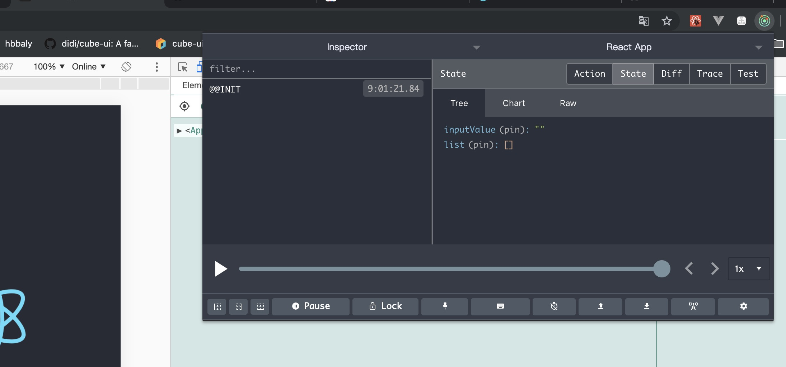

# redux


## 安装redux

```js
npm i redux -S
```

## 创建store

在`src`目录下创建`store`文件夹,并在文件夹内创建`index.js`,`reducer.js`

`index.js`代码
```js
import { createStore } from 'redux'
import reducer from './reducer.js
const store = createStore(reducer)
export default store
```

`reducer.js`代码

```js
const defaultState = {
  inputValue:'',
  list:[]
}
export default (state=defaultState, action) => {
  return state
}
```

`App.js`

```js
import React, { Component } from 'react'
import store from './store'
class TodoList extends Component {
  constructor() {
    super()
    this.state = store.getState()
    console.log(this.state)
  }
  render () {
    return (
      <div>store</div>
    )
  }
}
```
## redux-devtools-extension

[github](https://github.com/zalmoxisus/redux-devtools-extension)

`store/index.js`

```js
import { createStore } from 'redux'
import reducer from './reducer.js
const store = createStore(reducer, window.__REDUX_DEVTOOLS_EXTENSION__ && window.__REDUX_DEVTOOLS_EXTENSION__())
export default store
```

在此之前要在浏览器上搭梯子下载扩展程序图标
`Redux DevTools`插件。

运行可以得到：



