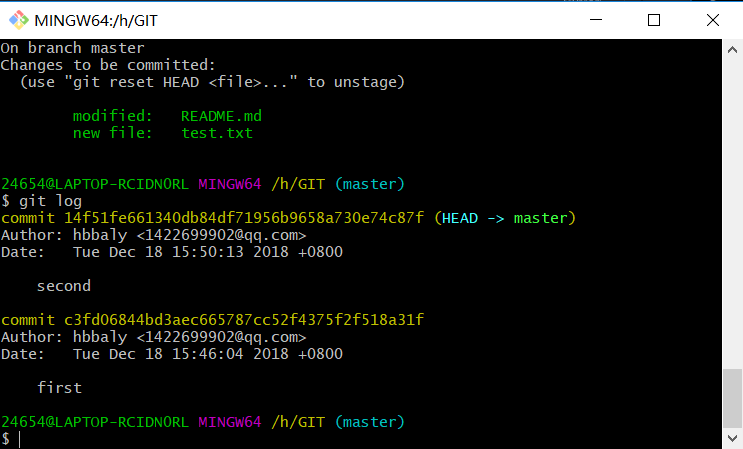

# Git

## `git init`

  初始化一个空的git仓库

## `git clone`

   克隆一个`git`仓库到本地

## `git add`

   将某个文件添加到缓存
  

  "AM"状态的意思是，这个文件在我们将它添加到缓存之后又有改动。改动后我们再执行 `git add` 命令将其添加到缓存中。

  **`git add `** 也可以添加多个文件
  

## `git status`

  `git status` 以查看在你上次提交之后是否有修改。 -s 参数，以获得简短的结果输出。如果没加该参数会详细输出内容。

## ` git diff `

  `git diff` 来查看执行 git status 的结果的详细信息。

  

  `git status` 显示你上次提交更新后的更改或者写入缓存的改动， 而 `git diff` 一行一行地显示这些改动具体是啥。

## `git commit -m `
   
   将缓存区的内容添加到仓库中。

   `Git` 为你的每一个提交都记录你的名字与电子邮箱地址，所以第一步需要配置用户名和邮箱地址。

   ### 配置用户名

    `git config --global user.name 'hbbaly'`

  ### 配置邮箱

    `git config --global user.email  '1422699902@qq.com'`

## `git mv `


修改某个文件的文件名

## `git log` 
   
   git log命令显示从最近到最远的提交日志



   `--pretty=oneline ` 参数显示 commit id(版本号)


## `git reset --hard HEAD^`

   在`Git`中，用`HEAD`表示当前版本 ,上一个版本就是`HEAD^`，上上一个版本就是`HEAD^^`，当然往上100个版本写100个^比较容易数不过来，所以写成 `HEAD~100`。

  **也可以这样**

  `git reset --hard 14f51fe`

  `hard` 后面版本号没必要写全，前几位就可以了， `Git` 会自动去找。

## `git reflog` 

    用来记录你的每一次命令


## `git checkout -- `


    在工作区的修改全部撤销  `只是工作区的修改不包括缓存部分`

## `git rm`

    删除某个文件

## `git branch`

    查看分支

## `git branch <name>`
    新建分支

## `git checkout <name>`

    切换分支

## `git checkout -b <name>`

    切换并创建分支

## `git merge <name>`

    合并某分支到当前分支

## `git branch -d <name>`

    删除分支

操作记录如下图：


## `分支管理策略`
 


    上图可以看出操作，我们首先使用`git checkout develop`切换`develop`分支,修改文件，提交。在切回`master`分支，合并`develop`代码。

    ```
      git merge --no-ff -m "merge with no-ff" develop
    ```

    `--no-ff` 参数，表示禁用`Fast forward`模式，`Git`就会在`merge`时生成一个新的`commit`，这样，从分支历史上就可以看出分支信息。

    `-m` 表示把`commit`描述写进去。

    `git log --graph --pretty=oneline --abbrev-commit`查看分支记录。

 **bug分支**


   如果工作中我们正在开发某个功能，突然接到一个紧急bug，需要现在修复，而我们手里功能写道一半，还没有提交到（`git commit`）**缓存区**。
   **git stash**可以把当前工作现场“储藏”起来，等以后恢复现场后继续工作。


   - 首先`git stash `把当前工作区中修改的内容保存，`git status`查看当前工作区，没有修改文件。
   - 创建并切换**bug-101**分支，修改并提交。
   - 切换回`master`分支，合并**bug-101** 分支
   - `git stash list`查看之前存储的内容,使用 `git stash apply`(但是恢复后，stash内容并不删除,也可以使用`git stash drop` 回复内容的同时，会删除)

- ## 丢弃没有被合并过的分支

    `git branch -D <name>`强制删除


## `git push`

## `git remote`

  当你从远程仓库克隆时，实际上Git自动把本地的master分支和远程的master分支对应起来了，并且，远程仓库的默认名称是**origin**。

  `git remote -v`

  查看详细远程库信息

## `推送分支`

  `git push origin <当前推送分支>`  

## `本地分支与远程分支关联`

  **`git checkout -b <name> origin/<name>`**

   在本地创建与远程分支对应的分支。

  **`git branch --set-upstream-to=origin/dev dev`**

  把本地dev分支与远程dev分支关联。

  **`git branch --set-upstream-to=origin/<远程分支> <本地分支>`**


# `git tag`

使用`git` 创建一个`tag` ,一个不可修改的历史代码版本。

## `git tag tagname `

  在当前分支打标签，  `git tag v1.0`  为当前分支打上v1.0的标签,只是在存储在本地。

## ` git tag`  

  查看当前分支所打标签，标签不是按时间顺序列出，而是按字母排序的

默认标签是打在最新提交的commit上的。有时候之前commit如果忘了打标签

可以找到历史提交的commit id，然后打上就可以了

`git tag v1.1 4fde738`  中找到commit id 为4fde738 为其打上v1.1标签。

## `git show <tagname> `

 查看标签信息


## `git tag -a <tagname> -m "<desc>" commit id`


   -a 表示打的标签名，-m 说明文字

## `删除标签`

  `git tag -d <tagname>`

  因为创建的标签，都是本地存储，没有提交到远程，可以删除。

  ## `推送某个标签到远程`


  **`git push origin <tagname>`**

  一次全部推送尚未推送到远程的本地标签

  **`git push origin --tags`**

## `删除远程标签`

  如果标签已经推送到远程，要删除远程标签就麻烦一点，先从本地删除：

  **`git tag -d <tagname>`**

  从远程删除。删除命令也是`push`

  **`git push origin :refs/tags/<tagname>`**

